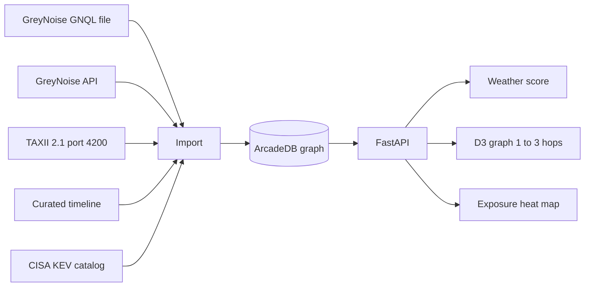

# Cyber Weather

Cyber Weather forecasts the incoming character of cyber events. GreyNoise behavioral tags are treated as precursors to vulnerability exploitation. CISA Known Exploited Vulnerabilities (KEV) marks a named storm. The first case is Citrix NetScaler CVE-2026-88771, where GreyNoise saw malicious behavior before the CVE tag existed and CISA added the CVE to KEV on disclosure.

## Architecture

GreyNoise and TAXII 2.1 land in one ArcadeDB graph. The API scores that graph and the UI draws a forecast, a D3 neighborhood, and an exposure map.



Import upserts stable keys, so a CVE or IP from GreyNoise and the same object from TAXII are one vertex. HTTP request bodies and exploit payloads are dropped before insert.

| Piece | Role |
| --- | --- |
| `ingest/` | GreyNoise file or API, TAXII 2.1 client, timeline, and KEV join |
| ArcadeDB | Vertices and edges for link analysis. Host port 2481, database `cyberweather` |
| `model/weather.py` | Clear, Watch, Advisory, Storm, Named storm |
| `api/main.py` | `/import`, `/forecast`, `/graph`, `/heatmap` |
| `web/` | Forecast brief, D3 force graph, MapLibre choropleth |

### Graph

Vertices are IP, tag, CVE, ASN, organization, source country, JA3 fingerprint, KEV record, event, and published indicator. Edges include `exploits`, `observed-with`, `hosted-by`, `same-fingerprint`, `listed-in-kev`, and `cited-by`, plus STIX relationship types from TAXII.

`GET /graph?focus=cve:CVE-2026-88771&hops=2` runs an ArcadeDB `TRAVERSE` limited to 1, 2, or 3 hops. In the UI, click a node to make it the hop origin. Drag a node, or use **Pin focus**, to set D3 `fx` and `fy` so the simulation leaves it in place.

### Forecast states

- **Clear** — no product crawler, scanner, or sibling exploitation
- **Watch** — crawler or scanner, and no CVE tag yet
- **Advisory** — crawler or scanner plus a sibling exploited CVE on the same product
- **Storm** — CVE-specific malicious tag, not spoofable
- **Named storm** — Storm plus CISA KEV

For this export the state is **Named storm**. The snapshot is after landfall: the 24 Sep lead time is reconstructed from co-occurring tags and the article timeline.

### Heat map

Two choropleth layers:

- **Sources** — where the malicious IPs geolocate
- **Sensor pressure** — how many of those IPs were seen toward each destination country

Destination counts are GreyNoise sensor coverage, not a map of confirmed vulnerable assets.

## Run

```bash
docker compose up -d
python3 -m venv .venv
.venv/bin/pip install -r requirements.txt
.venv/bin/python -m ingest --source greynoise
.venv/bin/python -m uvicorn api.main:app --host 127.0.0.1 --port 8000
```

In another terminal:

```bash
cd web
npm install
npm run dev
```

Open http://127.0.0.1:5173. The UI can import the local GreyNoise file, a live GNQL query, or a TAXII 2.1 collection.

```bash
.venv/bin/python -m ingest --source greynoise --mode api --query "cve:CVE-2026-88771 last_seen:30d AND spoofable:false AND classification:malicious"
.venv/bin/python -m ingest --source taxii --added-after 2026-09-27T00:00:00Z
```

| Variable | Default |
| --- | --- |
| `ARCADEDB_URL` | `http://127.0.0.1:2481` |
| `ARCADEDB_USER` / `ARCADEDB_PASSWORD` | `root` / `playwithdata` |
| `GREYNOISE_API_KEY` | unset; required for API mode |
| `TAXII_BASE_URL` | `http://127.0.0.1:4200` |
| `TAXII_TOKEN` | unset |
| `TAXII_COLLECTION_ID` | unset; import every readable collection |

Tests:

```bash
.venv/bin/python -m unittest tests.test_cyberweather
```
